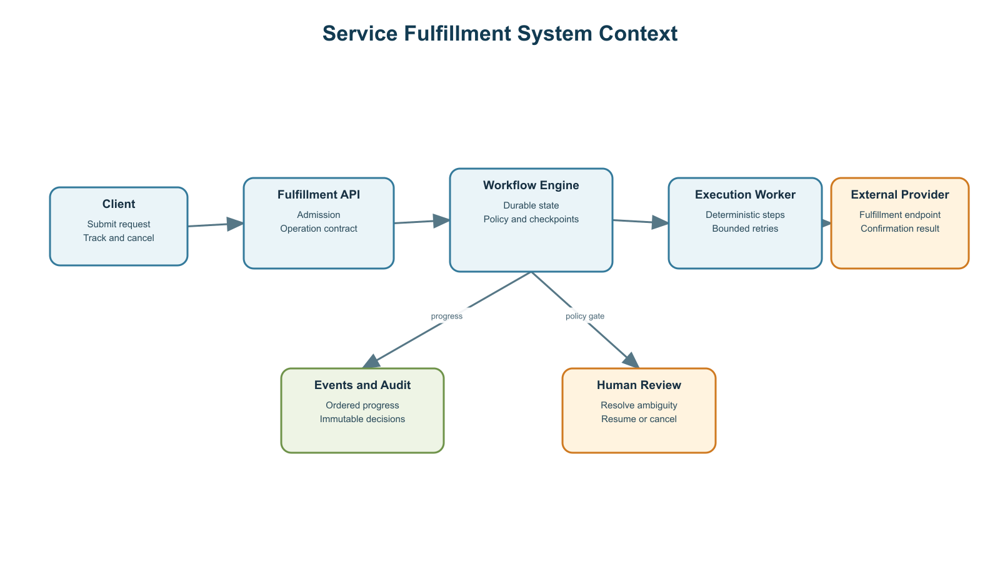
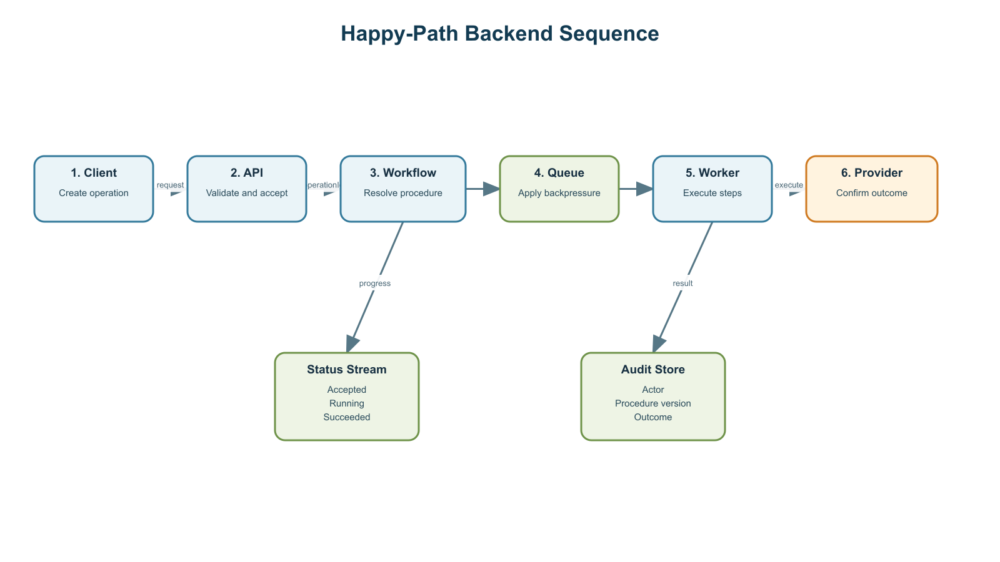
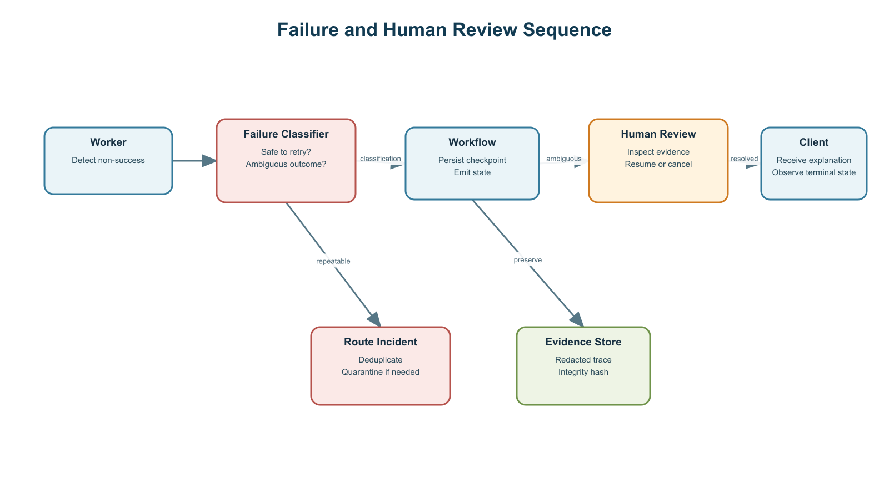
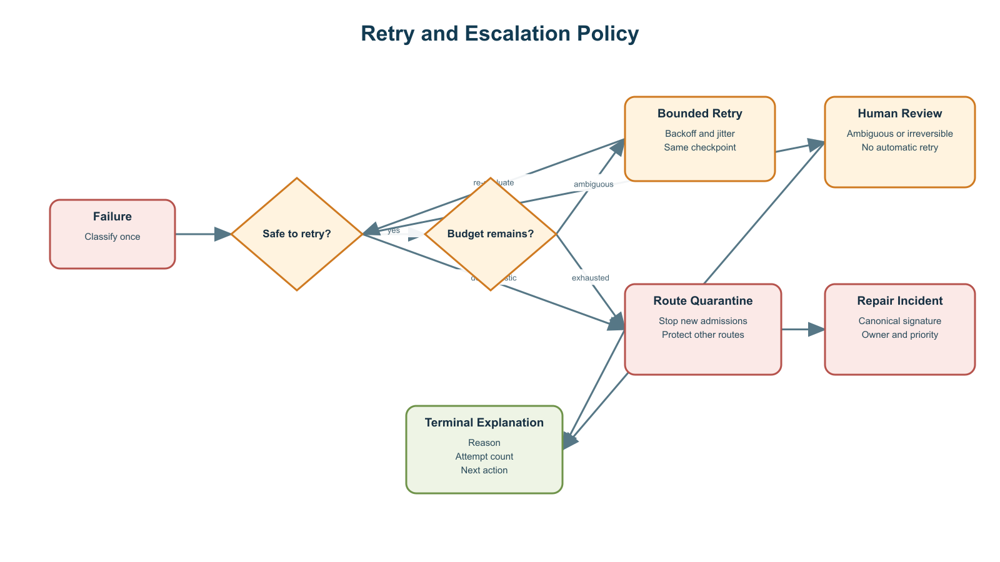
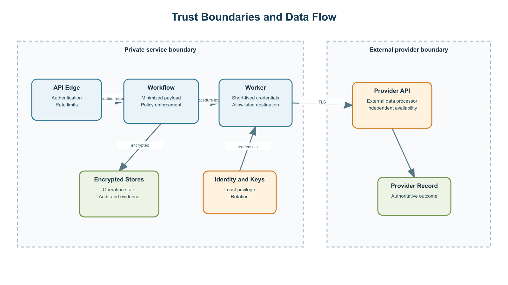
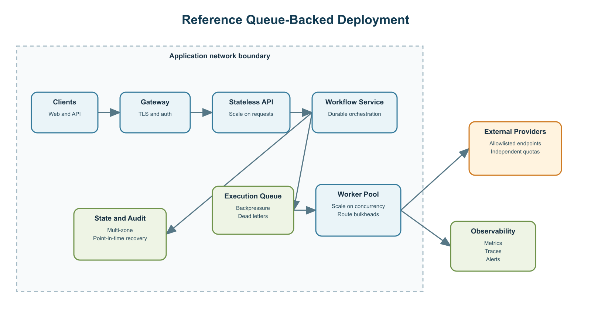

# Civic Service Fulfillment Architecture

## Table of Contents

The generated document lists only main sections. Explicit section numbers remain visible in file
previews even when a client does not support Word navigation fields.

## 1. Executive Summary

The Civic Service Fulfillment service accepts requests for standardized municipal services, executes
a versioned fulfillment procedure against an approved external provider, and returns a durable
operation identifier immediately. Callers observe ordered progress events rather than holding an
HTTP connection open for the complete execution time.

The online path is deterministic. Admission resolves a service route, validates required inputs,
pins a reviewed procedure version, and places the operation on a capacity-controlled queue. A
durable workflow engine owns state transitions, checkpoints, cancellation, and human-review waits;
stateless workers execute bounded steps and never make unapproved policy decisions.

Capacity is governed by in-flight work rather than request rate alone. The planning target is 300
concurrent operations at p95 runtime, with a 25 percent retry and burst reserve for 375 worker
slots. Per-provider bulkheads and queue-age admission thresholds prevent one degraded route from
consuming the whole service.

Sensitive fields are minimized at admission, encrypted in transit and at rest, and excluded from
ordinary logs. Every material state transition records the initiating actor, procedure version,
reason code, timestamp, and permitted next actions. Ambiguous outcomes and irreversible actions fail
closed into an attributable human-review task.

## 2. Scope and Audience

### 2.1 Decision Audience

This document supports the application team implementing the API and procedures, the platform team
hosting and operating the service, the security team approving trust boundaries, and support leads
designing human review. It defines contracts and operating requirements rather than prescribing a
single cloud product.

### 2.2 In Scope

- Admission, operation status, ordered events, cancellation, resume, and override APIs.
- Route and version resolution, durable workflow state, queueing, and deterministic execution.
- External-provider interaction, evidence handling, audit, human review, and repair incidents.
- Capacity, backpressure, security boundaries, deployment responsibilities, and recovery objectives.

### 2.3 Out of Scope

- Discovery of entirely new provider procedures; that lifecycle publishes reviewed versions into the
  procedure registry but is designed separately.
- Provider-owned availability, data correctness, and internal business processes.
- Caller user-interface design beyond the progress and action contracts required from the API.

## 3. Requirements and Assumptions

### 3.1 Functional Requirements

| ID      | Requirement                                                                                     | Source  | Owner          | Verification                                | Status   |
| ------- | ----------------------------------------------------------------------------------------------- | ------- | -------------- | ------------------------------------------- | -------- |
| REQ-001 | Return `operation_id`, `state`, and `accepted_at` within two seconds at p95 for valid requests. | EVD-001 | API owner      | Contract test and production latency SLI    | verified |
| REQ-002 | Emit ordered stage updates at least every ten seconds while useful work is progressing.         | EVD-002 | Workflow owner | Reconnect, ordering, and freshness tests    | verified |
| REQ-003 | Support idempotent create, status, cancellation, resume, and authorized override operations.    | EVD-001 | API owner      | API lifecycle and replay integration tests  | verified |
| REQ-004 | Reject unsupported routes and incomplete requests before consuming worker capacity.             | EVD-003 | Product owner  | Admission-policy test suite                 | accepted |
| REQ-005 | Pause before an irreversible provider action when policy requires human approval.               | EVD-003 | Policy owner   | Human-gate sequence and authorization tests | accepted |
| REQ-006 | Return a stable failure code, summarized event trail, recovery attempt, and safe next action.   | EVD-004 | Operations     | Failure-mode and operator-experience tests  | accepted |

### 3.2 Non-Functional Requirements

| Quality attribute    | Target                              | Measurement                                        |
| -------------------- | ----------------------------------- | -------------------------------------------------- |
| API availability     | 99.9 percent monthly                | Successful eligible requests at the service edge   |
| Progress freshness   | 10 seconds p95                      | Time since last ordered event for non-waiting work |
| Cancellation latency | 15 seconds p95                      | Cancel request to safe terminal checkpoint         |
| Workflow recovery    | RTO 60 minutes; RPO 5 minutes       | Quarterly restore and regional runbook exercise    |
| Audit completeness   | 100 percent of material transitions | Reconciliation of state and append-only events     |

### 3.3 Capacity Assumptions

| ID      | Assumption                                                                 | Evidence Needed                          | Owner             | Review Trigger                        | Status    |
| ------- | -------------------------------------------------------------------------- | ---------------------------------------- | ----------------- | ------------------------------------- | --------- |
| ASM-001 | Annual planning volume is 1.8 million operations.                          | Product forecast                         | Product owner     | Quarterly forecast refresh            | validated |
| ASM-002 | Peak accepted arrival rate is 2.5 operations per second.                   | Seasonal forecast and load test          | Capacity owner    | Peak traffic changes by 20 percent    | validated |
| ASM-003 | Average runtime is 45 seconds and p95 runtime is 120 seconds.              | Procedure telemetry                      | Workflow owner    | Procedure version or provider changes | validated |
| ASM-004 | A 25 percent reserve covers retries, provider latency, and short bursts.   | Failure telemetry and burst model        | Reliability owner | Retry rate exceeds 10 percent         | validated |
| ASM-005 | Structured logs and audit events require 180 days of searchable retention. | Security and operations retention policy | Security owner    | Policy or classification changes      | validated |

The annual planning volume is 1.8 million operations. Traffic is expected to peak at 2.5 accepted
operations per second. Average execution is 45 seconds and p95 execution is 120 seconds. Applying
Little's Law at the peak and p95 gives `2.5 operations/second × 120 seconds = 300` concurrent
operations. A 25 percent reserve for retries, provider latency, and short bursts raises the worker
and external-session planning target to 375 concurrent operations.

| Assumption                 | Planning value            | Evidence or owner                   |
| -------------------------- | ------------------------- | ----------------------------------- |
| Annual operations          | 1.8 million               | Product forecast; quarterly refresh |
| Peak accepted arrival rate | 2.5 operations per second | Load-test and seasonal forecast     |
| Average runtime            | 45 seconds                | Procedure telemetry owner           |
| p95 runtime                | 120 seconds               | Procedure telemetry owner           |
| Retry and burst reserve    | 25 percent                | Platform capacity owner             |
| Structured log retention   | 180 days                  | Security and operations policy      |

### 3.4 Constraints and Dependencies

External providers expose independent quotas and may return incomplete outcomes. Procedures must be
versioned, tested, and approved before online use. The workflow store, operation-event store, and
procedure registry must remain recoverable without depending on worker-local state.

## 4. Architecture Overview

### 4.1 System Context

Clients submit requests through an authenticated edge. The service creates durable operations,
executes approved procedures, communicates with allowlisted provider endpoints, and exposes progress
and human-action requirements through the operation API.

Editable source: [system-context.drawio](diagrams/system-context.drawio).

### 4.2 Core Components and State Ownership

| Component              | Responsibility                                      | Owned state                     | Failure responsibility                                                 |
| ---------------------- | --------------------------------------------------- | ------------------------------- | ---------------------------------------------------------------------- |
| API edge               | Authentication, schema validation, rate limits      | Request correlation only        | Reject invalid or unauthorized requests consistently                   |
| Fulfillment API        | Operation contract and admission                    | No worker-local state           | Return stable errors and idempotent acknowledgements                   |
| Workflow engine        | State transitions, timers, checkpoints, human waits | Durable operation state         | Replay safely after restart and prevent duplicate irreversible actions |
| Execution queue        | Backpressure and delivery                           | Pending execution messages      | Isolate poison messages and expose queue age                           |
| Worker pool            | Execute pinned deterministic procedures             | Ephemeral step context          | Classify failures and stop at safe boundaries                          |
| Procedure registry     | Route-to-version bindings and rollout state         | Versioned procedures and policy | Roll back or quarantine unsafe versions                                |
| Event and audit stores | Progress, decisions, evidence references            | Ordered and append-only records | Preserve integrity and retention policy                                |

### 4.3 Domain Model

`FulfillmentOperation` is runtime state. `ProcedureVersion`, `ProcedureBinding`, and `PolicySet` are
versioned design-time configuration. `Checkpoint` supports replay, `AuditEvent` explains decisions,
`FailureClass` controls safe automation, and `ReviewTask` records attributable operator action.

Editable source: [domain-model.drawio](diagrams/domain-model.drawio).

### 4.4 Configuration Model

Routes are keyed by tenant, service type, provider, and environment. Configuration precedence is
platform defaults, provider policy, tenant override, then operation input. Overrides may narrow
permissions and limits but may not bypass required input, evidence, or human gates. Every operation
pins the resolved configuration and procedure version before queueing.

## 5. Runtime Flows

### 5.1 Happy Path

The API validates identity, schema, route support, required inputs, and admission capacity. It then
creates the operation and returns its identifier. The workflow pins configuration, writes the first
checkpoint, enqueues execution, and emits `Accepted` and `Queued`. A worker performs deterministic
steps, records stage checkpoints, and submits the provider action with an idempotency key. Confirmed
completion produces `Succeeded`, a redacted result, and an immutable audit summary.

Editable source: [sequence-happy-path.drawio](diagrams/sequence-happy-path.drawio).

### 5.2 Admission Rejection and Runtime Failure

Unsupported routes return `UnsupportedRoute` before operation execution. Missing required input
returns a structured list of fields and does not enqueue work. Capacity pressure returns
`AdmissionDeferred` with `retry_after`. Runtime failures are classified once: transient safe-step
failures may retry within budget, repeatable route failures create one deduplicated incident, and
ambiguous post-submit outcomes require human review without automatic retry.

Editable source: [sequence-failure.drawio](diagrams/sequence-failure.drawio).

### 5.3 Operation State Model

Transitions are monotonic and persisted before publication. `WaitingForHuman` is non-terminal and
contains required action, allowed decisions, expiration, and evidence references. `CancelRequested`
is acknowledged immediately but becomes `Canceled` only at a safe checkpoint. Terminal states are
`Succeeded`, `Failed`, `Canceled`, and `Rejected`.

Editable source: [operation-state.drawio](diagrams/operation-state.drawio).

## 6. API and Data Contracts

### 6.1 External Operation API

`operation_id` is the stable contract. Callers construct known resource paths rather than depending
on returned navigation URLs. Create requests require an `Idempotency-Key`; action requests require
the expected operation version to prevent stale operator decisions.

| Operation | Signature                                                 | Successful result                                    |
| --------- | --------------------------------------------------------- | ---------------------------------------------------- |
| Create    | `POST /v1/fulfillment-operations`                         | `{ operation_id, state, accepted_at, retry_after? }` |
| Status    | `GET /v1/fulfillment-operations/{operation_id}`           | `OperationStatus` with permitted actions             |
| Events    | `GET /v1/fulfillment-operations/{operation_id}/events`    | SSE or page after `after_seq`                        |
| Cancel    | `POST /v1/fulfillment-operations/{operation_id}:cancel`   | Versioned `OperationAck`                             |
| Resume    | `POST /v1/fulfillment-operations/{operation_id}:resume`   | Versioned `OperationAck`                             |
| Override  | `POST /v1/fulfillment-operations/{operation_id}:override` | Actor-attributed `OperationAck`                      |

### 6.2 Internal Interfaces

| Interface              | Signature                                                                      | Owner                 |
| ---------------------- | ------------------------------------------------------------------------------ | --------------------- |
| Route resolution       | `resolveRoute(route_key) -> ProcedureBinding`                                  | Procedure registry    |
| Requirement validation | `validateRequirements(binding, request) -> ValidationResult`                   | Admission service     |
| Checkpoint             | `recordCheckpoint(operation_id, stage, state_ref) -> Checkpoint`               | Workflow engine       |
| Failure classification | `classifyFailure(stage, signal, evidence_refs) -> FailureClass`                | Worker policy library |
| Incident creation      | `createRouteIncident(route_key, signature, evidence_refs) -> IncidentRef`      | Reliability service   |
| Human review           | `createReviewTask(operation_id, reason, actions, evidence_refs) -> ReviewTask` | Operations platform   |

### 6.3 Event Contract

Each `OperationEvent` contains operation identifier, monotonic sequence, timestamp, actor, event
type, stage, redacted message, resulting state, and permitted actions. SSE uses the standard
`Last-Event-ID` cursor; polling uses `after_seq`. Reconnects replay persisted events, and a terminal
event is always followed by an audit-summary event.

## 7. Scalability and Resilience

### 7.1 Capacity and Scaling Planes

The API scales on request rate and latency. Workflow capacity scales on active operations and timer
throughput. Workers scale on runnable queue depth, oldest age, p95 procedure runtime, and external
quota headroom. Audit ingestion scales independently so a logging slowdown cannot block safe
workflow state persistence.

The initial worker target is 375 concurrent operations. Each provider receives a separate bulkhead
and configurable concurrency ceiling. A route may consume at most 20 percent of global runnable
capacity unless explicitly approved for a higher reservation.

### 7.2 Backpressure and Admission Control

Admission begins degrading when global concurrency reaches 80 percent, provider quota reaches 85
percent, or oldest runnable age exceeds 30 seconds. At 95 percent utilization or 90 seconds oldest
age, new low-priority work receives `AdmissionDeferred` with a bounded `retry_after`. Existing work,
cancellations, status, and human actions retain reserved capacity.

### 7.3 Retry and Escalation Policy

Editable source: [retry-escalation.drawio](diagrams/retry-escalation.drawio).

| Failure class                    | Automatic retry                                 | Checkpoint                            | Quarantine                                   | Human review                                            |
| -------------------------------- | ----------------------------------------------- | ------------------------------------- | -------------------------------------------- | ------------------------------------------------------- |
| Transient network before submit  | Maximum two with exponential backoff and jitter | Reuse last safe stage                 | After route error threshold                  | Only after budget exhaustion when action is recoverable |
| Provider throttling              | Honor provider delay within operation timeout   | Preserve operation and release worker | Reduce route admission                       | No unless request expires                               |
| Deterministic procedure mismatch | None                                            | Preserve failing stage and evidence   | Immediate version quarantine after threshold | No, unless no safe alternative exists                   |
| Ambiguous post-submit outcome    | Never                                           | Freeze submit checkpoint              | Protect route while investigated             | Required                                                |
| Policy blocked                   | None                                            | Persist policy decision               | Not applicable                               | Only when policy permits override                       |

### 7.4 Recovery and Retention

Workflow state uses multi-zone durability, five-minute point-in-time recovery, and a 60-minute RTO.
Procedure versions and bindings are replicated with a 15-minute RPO and a four-hour regional
recovery target. Audit events retain for 180 days in the searchable tier and then follow archival
policy. Evidence retention is separately configurable because size and sensitivity differ from
structured events. Restoration and replay are exercised quarterly.

### 7.5 Risk Records

| ID      | Risk                                                       | Likelihood | Impact | Mitigation                                                                    | Owner             | Status    | Approved By                       |
| ------- | ---------------------------------------------------------- | ---------- | ------ | ----------------------------------------------------------------------------- | ----------------- | --------- | --------------------------------- |
| RSK-001 | Ambiguous post-submit outcomes could cause duplicate work. | possible   | high   | Fail closed, freeze the checkpoint, and require human review.                 | Workflow owner    | mitigated | Architecture Review Board (human) |
| RSK-002 | A provider outage could exhaust global worker capacity.    | possible   | high   | Per-provider bulkheads, admission control, and reserved capacity.             | Reliability owner | mitigated | Reliability Review Lead (human)   |
| RSK-003 | Evidence could retain sensitive service-request data.      | possible   | high   | Minimize capture, encrypt, restrict access, and set class-specific retention. | Security owner    | mitigated | Security Review Lead (human)      |

## 8. Security, Privacy, and Audit

### 8.1 Data Classification and Minimization

The API accepts only fields required by the pinned route. Free-form attachments and unrelated notes
are rejected. The admission layer validates field allowlists before persistence, and ordinary events
contain redacted summaries rather than input payloads. Evidence references carry a data
classification and retention policy.

### 8.2 Identity, Encryption, and Secrets

Callers use short-lived service identity with tenant-scoped authorization. Workloads use distinct
least-privilege identities for workflow state, procedures, provider credentials, and evidence.
Transport uses modern TLS, stores use managed encryption keys, secrets are delivered just in time,
and production evidence access requires approved break-glass workflow with automatic expiration.

### 8.3 Trust Boundaries

Private control-plane services send only the minimized procedure input across the provider trust
boundary. Provider destinations are allowlisted, credentials are route-scoped, and responses are
validated before state transition. External systems remain independently available and cannot be
trusted as the sole audit record.

Editable source: [trust-boundary.drawio](diagrams/trust-boundary.drawio).

### 8.4 Audit and Evidence

Append-only audit events record who initiated the operation, the resolved route, procedure and
policy versions, deterministic decisions, retries, human actions, timestamps, and terminal outcome.
Daily reconciliation compares operation state with audit sequence continuity. Evidence objects are
encrypted, integrity-hashed, access-logged, and deleted by their data-class policy.

## 9. Human Escalation and Failure Handling

### 9.1 Escalation Ladder

The escalation order is safe bounded retry, provider or route throttling, version quarantine,
rollback to a known-good version, route repair incident, and human review. Irreversible ambiguity
skips automatic recovery and moves directly to human review. No operator can resume work without an
allowed action and an actor-attributed reason.

### 9.2 Operator Experience

Review tasks include reason code, failed stage, concise event summary, redacted evidence references,
allowed actions, expected operation version, and expiration. The target is five minutes for
high-priority ambiguity and four business hours for recoverable exceptions. Expired tasks cancel or
fail according to route policy; they never resume implicitly.

### 9.3 Failure Response

Callers receive operation state, stable failure code, failed stage, attempt count, recovery already
performed, whether a route incident exists, safe next actions, and a support correlation identifier.
Messages distinguish non-success outcomes such as rejection or cancellation from infrastructure
failures.

## 10. Ownership and Operating Model

### 10.1 Solution Team

The solution team owns external and internal API semantics, operation states, procedures, route
requirements, policy gates, idempotency, failure taxonomy, event explanations, and compatibility
tests. It publishes versioned procedures and defines safe rollback boundaries.

### 10.2 Hosting Team

The hosting team owns accounts and subscriptions, network controls, workload identity integration,
compute and queue configuration, encryption-key operations, observability transport, backup,
restoration, quota monitoring, and regional recovery execution.

### 10.3 Shared Responsibilities

| Concern           | Solution team                            | Hosting team                                     | Evidence of readiness                 |
| ----------------- | ---------------------------------------- | ------------------------------------------------ | ------------------------------------- |
| Capacity          | Supply runtime and retry distributions   | Provision quotas and autoscaling                 | Joint load test and quota dashboard   |
| Security          | Minimize fields and redact evidence      | Enforce identity, keys, network, and access logs | Threat model and control verification |
| Reliability       | Classify failures and define checkpoints | Operate queues, stores, alerts, and recovery     | Game day and replay report            |
| Incident response | Diagnose procedure and route behavior    | Diagnose platform and dependency health          | Shared runbook and escalation roster  |

## 11. Reference Deployment

The reference deployment uses an authenticated gateway, stateless API replicas, a durable workflow
service, a managed queue with dead-letter isolation, horizontally scaled workers, multi-zone state
stores, and independent observability. Private services reach only approved provider endpoints.
Workers scale on concurrency and queue age rather than CPU alone. Status and cancellation reserve
capacity so overload does not hide or trap active work.

Editable source: [reference-deployment.drawio](diagrams/reference-deployment.drawio).

## 12. Architecture Decisions

| ID      | Decision                              | Rationale                                                        | Consequences                             | Status   | Owner           | Approved By                       |
| ------- | ------------------------------------- | ---------------------------------------------------------------- | ---------------------------------------- | -------- | --------------- | --------------------------------- |
| ADR-001 | Use an operation-centric API.         | Stable identity supports polling, streaming, cancel, and resume. | Clients manage asynchronous state.       | accepted | API owner       | Architecture Review Board (human) |
| ADR-002 | Use a durable workflow engine.        | Checkpoints and waits survive process restarts.                  | Adds a platform dependency.              | accepted | Platform owner  | Architecture Review Board (human) |
| ADR-003 | Keep online procedures deterministic. | Behavior remains predictable, auditable, and latency-bounded.    | New routes require reviewed publication. | accepted | Workflow owner  | Architecture Review Board (human) |
| ADR-004 | Bind routes to committed versions.    | Rollback and canary promotion remain explicit.                   | Registry lifecycle must be operated.     | accepted | Procedure owner | Architecture Review Board (human) |
| ADR-005 | Fail closed on ambiguity.             | Duplicate irreversible actions are less likely.                  | Human review can delay completion.       | accepted | Policy owner    | Security Review Lead (human)      |

## 13. References

| ID      | Supports                                                      | Source                                                                               | Retrieved On | Notes                                                       |
| ------- | ------------------------------------------------------------- | ------------------------------------------------------------------------------------ | ------------ | ----------------------------------------------------------- |
| EVD-001 | REQ-001, REQ-003, ADR-001                                     | [RFC 9110: HTTP Semantics](https://www.rfc-editor.org/rfc/rfc9110)                   | 2026-08-20   | HTTP semantics and idempotent request behavior.             |
| EVD-002 | REQ-002                                                       | [Server-Sent Events](https://html.spec.whatwg.org/multipage/server-sent-events.html) | 2026-08-20   | Ordered event streaming and reconnect semantics.            |
| EVD-003 | REQ-004, REQ-005, ADR-002, ADR-003, ADR-004, ADR-005, RSK-001 | Architecture discovery and policy workshop                                           | 2026-08-20   | Example human-reviewed project input.                       |
| EVD-004 | REQ-006, RSK-002, RSK-003                                     | [NIST Secure Software Development Framework](https://csrc.nist.gov/Projects/ssdf)    | 2026-08-20   | Secure development and operational evidence guidance.       |
| EVD-005 | ASM-001, ASM-002, ASM-003, ASM-004, ASM-005                   | Capacity forecast, load-test report, telemetry baseline, and retention policy        | 2026-08-20   | Sanitized evidence catalog entry for the reference project. |

- [RFC 9110: HTTP Semantics](https://www.rfc-editor.org/rfc/rfc9110)
- [RFC 9457: Problem Details for HTTP APIs](https://www.rfc-editor.org/rfc/rfc9457)
- [Server-Sent Events](https://html.spec.whatwg.org/multipage/server-sent-events.html)
- [NIST Secure Software Development Framework](https://csrc.nist.gov/Projects/ssdf)
