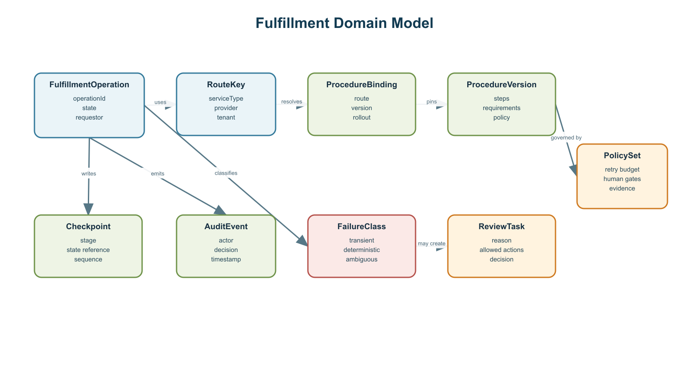
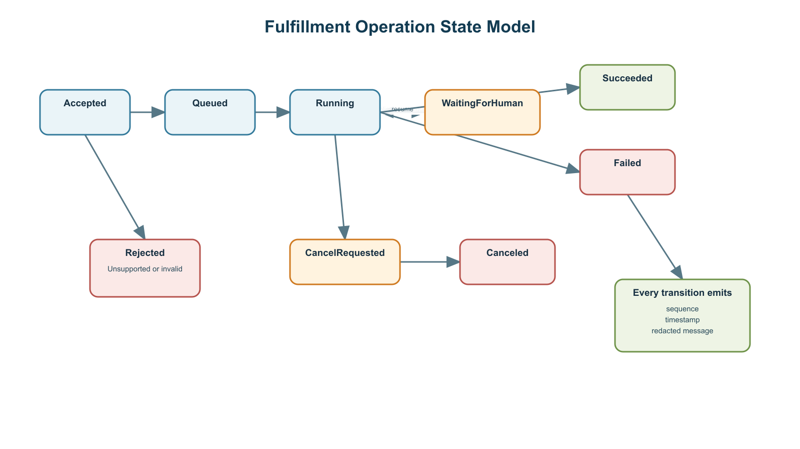

# [Service Name] Architecture

## Table of Contents

The generated document lists main sections here. Explicit section numbers remain visible when a
preview client does not support Word navigation fields.

## 1. Executive Summary

Describe the service, the decision this document supports, and the architectural position in three
to five paragraphs. Lead with the outcome rather than implementation inventory.

State the most important design choices, scale boundary, security posture, and division of
responsibility. Identify assumptions that could materially change the design.

## 2. Scope and Audience

### 2.1 Decision Audience

Name the teams that will build, host, operate, secure, and approve the service. Explain what each
audience should be able to decide after reading the document.

### 2.2 In Scope

- List the runtime components and workflows covered by this architecture.
- Include caller interactions, durable state, external dependencies, and operational controls.
- Include the interfaces between product-owned and hosting-owned responsibilities.

### 2.3 Out of Scope

- List adjacent systems that are referenced but not designed here.
- Separate future work from deliberate non-goals.

## 3. Requirements and Assumptions

### 3.1 Functional Requirements

| ID      | Requirement                                                                                   | Source                       | Owner          | Verification                       | Status   |
| ------- | --------------------------------------------------------------------------------------------- | ---------------------------- | -------------- | ---------------------------------- | -------- |
| REQ-001 | Replace with the first externally observable service outcome.                                 | Discovery input (unverified) | Product owner  | Define an acceptance test.         | proposed |
| REQ-002 | Long-running operations expose progress, cancellation, resume, and authorized override.       | Discovery input (unverified) | API owner      | Exercise the API lifecycle test.   | proposed |
| REQ-003 | Admission rejects unsupported inputs before capacity is consumed and gates irreversible work. | Discovery input (unverified) | Workflow owner | Exercise rejection and gate tests. | proposed |

### 3.2 Non-Functional Requirements

| Quality attribute    | Target        | Measurement                    |
| -------------------- | ------------- | ------------------------------ |
| Availability         | [target]      | [service-level indicator]      |
| Progress freshness   | [target]      | [event or polling metric]      |
| Cancellation latency | [target]      | [request-to-checkpoint metric] |
| Recovery             | [RTO and RPO] | [recovery test]                |

### 3.3 Capacity Assumptions

| ID      | Assumption                                                   | Evidence Needed                      | Owner             | Review Trigger                | Status |
| ------- | ------------------------------------------------------------ | ------------------------------------ | ----------------- | ----------------------------- | ------ |
| ASM-001 | Replace with annual and peak operation volume.               | Forecast and observed demand         | Capacity owner    | Quarterly or material growth  | open   |
| ASM-002 | Replace with average and p95 end-to-end runtime.             | Production-like load test            | Workflow owner    | Runtime model changes         | open   |
| ASM-003 | Replace with retry and burst inflation used for concurrency. | Failure telemetry and seasonal model | Reliability owner | Retry policy or traffic shift | open   |

Document annual volume, peak arrival rate, average and p95 runtime, retry inflation, and the
resulting peak concurrency. Show the calculation so the hosting team can replace assumptions with
measured values.

| Assumption        | Planning value | Evidence or owner |
| ----------------- | -------------- | ----------------- |
| Annual operations | [value]        | [source]          |
| Peak arrival rate | [value]        | [source]          |
| Average runtime   | [value]        | [source]          |
| p95 runtime       | [value]        | [source]          |
| Retry inflation   | [value]        | [source]          |

### 3.4 Constraints and Dependencies

List contractual, regulatory, networking, data residency, external quota, and platform constraints.

## 4. Architecture Overview

### 4.1 System Context

Explain the system boundary, callers, external providers, and authoritative systems of record.

Editable source: [system-context.drawio](diagrams/system-context.drawio).

### 4.2 Core Components and State Ownership

| Component              | Responsibility                     | Owned state       | Failure responsibility |
| ---------------------- | ---------------------------------- | ----------------- | ---------------------- |
| API                    | [admission and operation contract] | [state or none]   | [behavior]             |
| Workflow engine        | [durable orchestration]            | [workflow state]  | [behavior]             |
| Worker                 | [deterministic execution]          | [ephemeral state] | [behavior]             |
| Event and audit stores | [progress and evidence]            | [durable records] | [behavior]             |

### 4.3 Domain Model

Describe versioned design-time entities separately from runtime state, audit evidence, and operator
decisions.

Editable source: [domain-model.drawio](diagrams/domain-model.drawio).

### 4.4 Configuration Model

Define provider-specific settings, tenant overrides, required inputs, policy gates, retry budgets,
evidence policy, and version binding. State precedence and validation rules.

## 5. Runtime Flows

### 5.1 Happy Path

Describe admission, durable operation creation, queueing, execution, external interaction,
confirmation, progress events, and audit synthesis.

Editable source: [sequence-happy-path.drawio](diagrams/sequence-happy-path.drawio).

### 5.2 Admission Rejection and Runtime Failure

Document unsupported routes, missing inputs, policy rejection, quota backpressure, deterministic
drift, transient infrastructure failure, and ambiguous irreversible outcomes.

Editable source: [sequence-failure.drawio](diagrams/sequence-failure.drawio).

### 5.3 Operation State Model

Every state transition should produce an ordered event with a timestamp, actor, stage, redacted
message, and permitted next actions.

Editable source: [operation-state.drawio](diagrams/operation-state.drawio).

## 6. API and Data Contracts

### 6.1 External Operation API

Use a stable operation identifier rather than returned URLs as the primary contract. Define exact
request, response, error, idempotency, authentication, and authorization semantics.

| Operation | Signature                                     | Responsibility                             |
| --------- | --------------------------------------------- | ------------------------------------------ |
| Create    | `POST /v1/operations`                         | Validate and create a durable operation    |
| Status    | `GET /v1/operations/{operation_id}`           | Return current state and permitted actions |
| Events    | `GET /v1/operations/{operation_id}/events`    | Stream or page ordered progress events     |
| Cancel    | `POST /v1/operations/{operation_id}:cancel`   | Request cancellation at a safe checkpoint  |
| Resume    | `POST /v1/operations/{operation_id}:resume`   | Resume after required input or approval    |
| Override  | `POST /v1/operations/{operation_id}:override` | Apply an authorized, audited decision      |

### 6.2 Internal Interfaces

Define route resolution, requirement validation, worker start, checkpoint write, failure
classification, incident creation, and human-review task creation.

### 6.3 Event Contract

Specify monotonic sequence numbers, replay behavior, redaction, reconnect cursors, terminal events,
and progress freshness.

## 7. Scalability and Resilience

### 7.1 Capacity and Scaling Planes

Separate stateless request scaling, durable workflow throughput, queue capacity, worker concurrency,
external quota, and observability ingestion.

### 7.2 Backpressure and Admission Control

Define queue-depth, oldest-age, quota-utilization, and per-route thresholds. State degraded caller
messaging and retry-after behavior.

### 7.3 Retry and Escalation Policy

Editable source: [retry-escalation.drawio](diagrams/retry-escalation.drawio).

| Failure class                  | Retry             | Checkpoint | Quarantine  | Human review |
| ------------------------------ | ----------------- | ---------- | ----------- | ------------ |
| Transient infrastructure       | [bounded policy]  | [behavior] | [threshold] | [condition]  |
| Deterministic route failure    | [fail closed]     | [behavior] | [threshold] | [condition]  |
| Ambiguous irreversible outcome | [never automatic] | [behavior] | [behavior]  | Required     |

### 7.4 Recovery and Retention

Define backup scope, RTO, RPO, restoration tests, multi-zone behavior, regional recovery posture,
and retention by data class.

### 7.5 Risk Records

| ID      | Risk                                                        | Likelihood | Impact | Mitigation                                    | Owner          | Status | Approved By               |
| ------- | ----------------------------------------------------------- | ---------- | ------ | --------------------------------------------- | -------------- | ------ | ------------------------- |
| RSK-001 | Replace with the highest material architecture risk.        | unknown    | high   | Define a measurable mitigation and test.      | Risk owner     | open   | Pending human disposition |
| RSK-002 | Ambiguous irreversible outcomes could cause duplicate work. | possible   | high   | Fail closed and require authoritative review. | Workflow owner | open   | Pending human disposition |

## 8. Security, Privacy, and Audit

### 8.1 Data Classification and Minimization

List allowed, conditionally allowed, and prohibited inputs. Explain field-level minimization and
whether evidence can contain sensitive values.

### 8.2 Identity, Encryption, and Secrets

Define caller authentication, service authorization, workload identity, least privilege, encryption
in transit and at rest, key ownership, rotation, and break-glass access.

### 8.3 Trust Boundaries

Editable source: [trust-boundary.drawio](diagrams/trust-boundary.drawio).

### 8.4 Audit and Evidence

Define immutable or append-only events, actor attribution, timestamps, procedure versions, decision
explanations, evidence integrity, access review, redaction, and retention.

## 9. Human Escalation and Failure Handling

### 9.1 Escalation Ladder

Define the ordered path from safe bounded retry to route quarantine, rollback, repair incident,
human review, and terminal explanation.

### 9.2 Operator Experience

Define required-action payloads, evidence summaries, allowed decisions, service-level targets,
cancel latency, stale-task handling, and caller-visible degraded-mode messages.

### 9.3 Failure Response

Require a stable failure code, failed stage, summarized event log, attempted recovery, operation
state, safe next actions, and support correlation identifier.

## 10. Ownership and Operating Model

### 10.1 Product or Solution Team

Assign API semantics, workflow behavior, domain model, failure taxonomy, and business policy.

### 10.2 Hosting or Platform Team

Assign cloud foundations, network controls, identity integration, service quotas, monitoring,
backup, and disaster recovery execution.

### 10.3 Shared Responsibilities

| Concern           | Solution team    | Hosting team     | Evidence of readiness |
| ----------------- | ---------------- | ---------------- | --------------------- |
| Capacity model    | [responsibility] | [responsibility] | [artifact]            |
| Security controls | [responsibility] | [responsibility] | [artifact]            |
| Incident response | [responsibility] | [responsibility] | [artifact]            |

## 11. Reference Deployment

Describe one deployable example without making a product-specific deployment the architecture
itself. Connect each component to scaling signals, data stores, trust boundaries, and ownership.

Editable source: [reference-deployment.drawio](diagrams/reference-deployment.drawio).

## 12. Architecture Decisions

| ID      | Decision                                                    | Rationale                                     | Consequences                                     | Status   | Owner              | Approved By            |
| ------- | ----------------------------------------------------------- | --------------------------------------------- | ------------------------------------------------ | -------- | ------------------ | ---------------------- |
| ADR-001 | Use a stable operation identifier for long-running work.    | Polling, streaming, cancel, and resume align. | Clients must manage asynchronous state.          | proposed | API owner          | Pending human approval |
| ADR-002 | Keep Markdown and draw.io as canonical architecture source. | Text and diagrams remain reviewable in Git.   | Generated DOCX and PNG files must not be edited. | proposed | Architecture owner | Pending human approval |

Record consequential decisions as short architecture decision records when the table is not enough.

## 13. References

| ID      | Supports         | Source                      | Retrieved On | Notes                                               |
| ------- | ---------------- | --------------------------- | ------------ | --------------------------------------------------- |
| EVD-001 | REQ-001, ASM-001 | Replace with primary source | 1970-01-01   | Starter placeholder; not sufficient for acceptance. |

- Link primary platform documentation, standards, threat models, quota documentation, and decision
  records used by the architecture.
